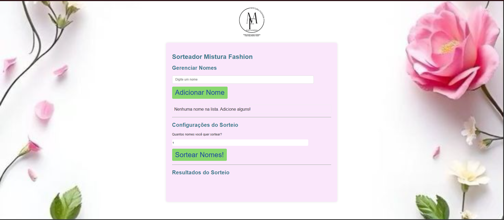

# 🎲 Sorteador Mistura Fashion



Um aplicativo web simples e interativo para sortear nomes de forma aleatória, ideal para rifas, sorteios em redes sociais ou a escolha de vencedores em eventos.

Este projeto foi desenvolvido utilizando **HTML, CSS e JavaScript puro (Vanilla JS)**, focando na praticidade e na experiência do usuário.

## 🔗 Demonstração

Você pode visualizar a aplicação rodando em:
**[https://flaviocalaca.github.io/Sorteado-personalizado](https://flaviocalaca.github.io/Sorteado-personalizado)**

## ✨ Funcionalidades

* **Gerenciamento de Nomes:** Adicione e remova participantes facilmente da lista.
* **Controle de Duplicidade:** O sistema impede a adição de nomes duplicados, garantindo uma lista limpa.
* **Sorteio Múltiplo:** Defina a quantidade exata de nomes que você deseja sortear de uma só vez.
* **Sorteio Aleatório e Sem Repetição:** A lógica de sorteio garante que cada nome seja sorteado apenas uma vez em cada rodada.
* **Feedback Visual:** Inclui uma pequena animação de "embaralhamento" dos nomes antes de revelar os vencedores, melhorando a experiência do usuário.
* **Design Responsivo:** Layout adaptável para dispositivos móveis e desktops.

## 🚀 Como Usar

1.  **Clone o Repositório:**
    ```bash
    git clone [https://github.com/flaviocalaca/Sorteado-personalizado.git](https://github.com/flaviocalaca/Sorteado-personalizado.git)
    ```
2.  **Abra o `index.html`:**
    Basta abrir o arquivo `index.html` em qualquer navegador (Chrome, Firefox, Edge, etc.) diretamente do seu computador.
3.  **Interaja:** Use a interface para adicionar/remover nomes, configurar o número de resultados e iniciar o sorteio.

## ⚙️ Tecnologias Utilizadas

| Tecnologia | Descrição |
| :--- | :--- |
| **HTML5** | Estrutura semântica da aplicação. |
| **CSS3** | Estilização, layout e media queries para responsividade. |
| **JavaScript (ES6+)** | Lógica de gerenciamento de lista, controle de estado, manipulação eficiente do DOM e uso de `async/await` para a animação de sorteio. |

## 🤝 Contribuições

Contribuições são bem-vindas! Se você tiver sugestões, melhorias ou correções de bugs, sinta-se à vontade para abrir uma *issue* ou enviar um *Pull Request*.

## 👨‍💻 Autor

**José Flavio**

* Demonstração (GitHub Pages): [https://flaviocalaca.github.io/Sorteado-personalizado](https://flaviocalaca.github.io/Sorteado-personalizado)
* GitHub: [https://github.com/flaviocalaca](https://github.com/flaviocalaca)
* LinkedIn: [https://www.linkedin.com/in/joseflaviocalaça/ca](https://www.linkedin.com/in/joseflaviocalaça/ca)

## 📜 Licença

Este projeto está sob a **Licença MIT** - veja o arquivo [LICENSE](LICENSE) para mais detalhes.
